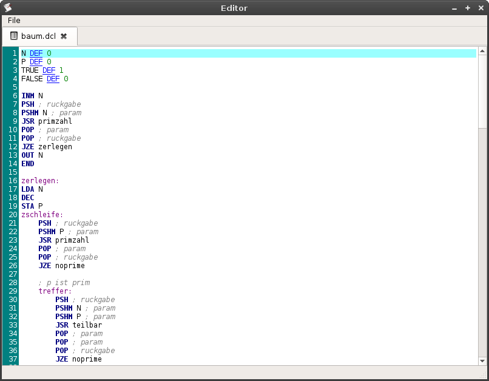

The DC file editor
==================

DC has a small text editor built in. The text editor supports syntax
highlighting for DC and DCL programs.

Opening the editor
------------------

To open the editor, just press the Editor button in the DC main window or use
the "editor" command in the DC command line.

Fixing line numbers
-------------------

The "Fix line numbers" function from the file menu renumerates the lines,
starting with 0 at the top line. This is useful if you insert lines in a DC
program. Note that it doesn't fix JMP targets, so you need to manually correct
those. It is advised that you use the DCL language for this reason as DCL
doesn't need line numbers.

Before::

    0 DEF 2
    OUT 20
    1 INM 50
    2 LDA 50

Note that the second line got inserted later. After the fix::

    0 DEF 2
    1 OUT 20
    2 INM 50
    3 LDA 50

Note that the OUT/INM/LDA parameters did not change.
